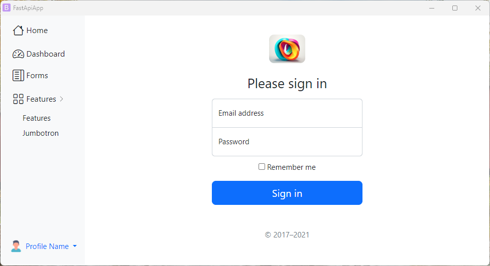

## Usage with FastAPI

```py
#main.py
from fastapi import FastAPI, Request
from fastapi.responses import HTMLResponse
from fastapi.staticfiles import StaticFiles
from fastapi.templating import Jinja2Templates
from fastapi import FastAPI
from webgui import GUI

app = FastAPI()

# Mounting default static files
app.mount("/public", StaticFiles(directory="dist/"))
templates = Jinja2Templates(directory="dist")

@app.get("/", response_class=HTMLResponse)
async def root(request: Request):
    return templates.TemplateResponse("index.html", {"request": request})

@app.get("/home", response_class=HTMLResponse)
async def home(request: Request):
    return templates.TemplateResponse("home.html", {"request": request})

if __name__ == "__main__":
    GUI(app=app, server="fastapi").run()
```


## Close application using a route

You can close the application using the `close_application` from webgui.

```python

from webgui import GUI, close_application

# Any python webframework routing here
@app.route("/close", methods=["GET"])
def close_window():
    close_application()
```



## Configurations

Default GUI class parameters:

- `server: Union[str, Callable[[Any], None]]`: function which receives `server_kwargs` to start server (see examples folder);
- `server_kwargs: dict = None`: kwargs which will be passed down to `server` function;
- `app: Any = None`: `wsgi` or `asgi` app;
- `port: int = None`: specify port if not a free port will set;
- `width: int = None`: width of the window;
- `height: int = None`: height of the window;
- `fullscreen: bool = True`: start app in fullscreen (maximized);
- `on_startup: Callable = None`: function to before starting the browser and webserver;
- `on_shutdown: Callable = None`: function to after the browser and webserver shutdown;
- `extra_flags: List[str] = None`: list of additional flags for the browser command;
- `browser_path: str = None`: set path to chrome executable or let the defaults do that;
- `browser_command: List[str] = None`: command line with starts chrome in `app` mode;
- `socketio: Any = None`: socketio instance in case of flask_socketio;


## Distribution

You can distribute it as a standalone desktop app with **pyinstaller**. If pyinstaller failes try pyinstaller version 5.6.2.

```shell
pyinstaller -w -F  main.py
```

After the command finishes move your files (templates, js,css etc) to the `dist` folder created by pyinstaller. Or add them into the executable: `pyinstaller -w -F --add-data "templates;templates" --add-data "static;static" main.py` (for Linux change `;` with `:`).


## Observations

- Parameters `width`, `height` and maybe `fullscreen` may not work on Mac;
- Window control is limited to width, height, fullscreen;
- Remember the gui is still a browser - pressing F5 will refresh the page + other browser specific things (you can hack it with js though);